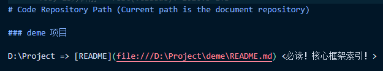
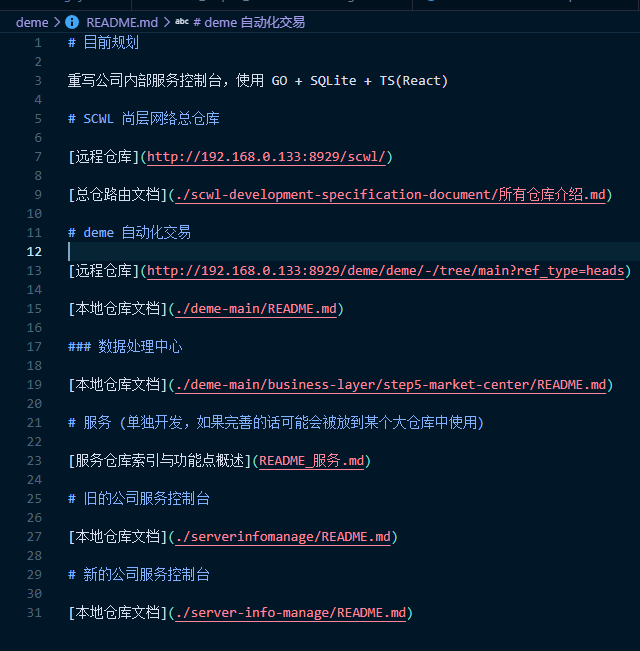

# ai-template

AI 编码辅助模板仓库，通过 Git 子模块引入项目，为 AI 编码助手提供统一的工作规范、技能集与工具链。

**仓库地址**：`@TODO`

## 结构说明

```
.claude/
├── commands/
│   └── A.md              # 核心指令：定义 Mode、Tool、Skill 等工作规范
├── agent-skill/
│   └── AgentSkill.md     # 技能编写规范（仅创建/更新技能时使用）
├── memory/               # 持久记忆（用户偏好、模式库），跨会话积累
│   ├── profile.md        # 用户偏好与技术栈
│   └── patterns.md       # 验证过的有效方案与反面教训
├── scripts/              # 自动化脚本
│   ├── Evolve-Claude.ps1 # 任务结束时评估 .claude 资源更新
│   ├── List-Skills.ps1   # 会话开始时列出技能树
│   └── Read-Memory.ps1   # 会话开始时加载持久记忆
├── skills/               # 技能集（子模块/本地目录），供指令文件使用
│   └── ...
├── tools/
│   └── CoreTool.md       # 按需工具参考：Depend、Study、Xray
├── image/                # 文档截图
└── README.md             # 当前文件
```

## 快速上手

> **嵌套关系**：你的项目 → `.claude`（子模块） → `.claude/skills/*`（.claude 自身的子模块）。
> 所有涉及子模块的命令都需要 `--recursive` 来处理这层嵌套。

### 场景 A：首次为项目引入 .claude

```bash
# ① 在项目根目录添加 .claude 子模块
cd <项目根目录>
git submodule add @TODO.git .claude

# ② 初始化 .claude 内部的嵌套子模块（skills/*）
cd .claude
git submodule update --init --recursive
cd ..

# ③ 提交
git add .claude .gitmodules
git commit -m "chore: add .claude submodule"
```

### 场景 B：克隆已含 .claude 的项目

```bash
# 一步到位（--recurse-submodules 会自动处理所有嵌套）
git clone --recurse-submodules <项目仓库地址>
```

如果克隆时忘了加 `--recurse-submodules`，补救：

```bash
cd <项目目录>
git submodule update --init --recursive
```

### 更新 .claude 至最新版本

```bash
cd <项目根目录>/.claude
git pull origin main
git submodule update --init --recursive   # 同步 skills 嵌套子模块
cd ..
git add .claude
git commit -m "chore: update .claude submodule"
```

## Commands 使用说明

### 调用格式

**`#file:A.md` 为 Copilot 引用文件的方式，可简写为 `#A.md` 并选中相应文件；在 Claude Code 中格式为 `/A`。**

```
#file:A.md Read: [目标路径/auto]
Impl: [任务描述]
```

- **Read**：指定需要分析的目标路径，`auto` 表示由 AI 自行判断需要读取的范围
- **Impl**：描述具体要完成的任务

两者可单独使用，也可组合使用。

### 示例

#### 快速学习

```
#file:A.md Read: D:\Project\deme\README.md
Impl: 我现在要快速学习这个 deme，请深度学习所有仓库后，用任务形式（格式：[] xx）在 TODO 给我规划学习路线
```

#### 代码实现

```
#file:A.md Read: D:\Project\deme\xx1、D:\Project\deme\xx2、D:\Project\deme\xx3
Impl: ...
```

#### 指定技能实现

```
#file:A.md Read auto
Impl: 使用 xx 技能完成 ...
```

```
#file:A.md 使用开发规范技能提交更改
```

#### 添加技能子模块

通过 Git 子模块引入外部仓库中的技能/规范文档：

```
#file:A.md Read auto
Impl: 将 http://xxx.git 作为新技能在 skills 中使用子模块同步，并在 A.md 的 Skill 标题下新增同步说明与索引
```

### 本地仓库索引配置

在项目的指令文件（如 [A.md](./commands/A.md)）中配置本地仓库路径，AI 会自动读取对应的 README 建立上下文：

> 命令文档链接



> 索引文档示例



## Skills 子模块管理

Skills 目录通过 Git 子模块引入外部仓库中的技能/规范文档，供 AI 在编码时参考。

### 子模块列表

[.gitmodules](.gitmodules)

### 初始化子模块（首次克隆后）

```bash
git submodule update --init --recursive
```

### 更新子模块至最新版本

```bash
git submodule update --remote --merge
```

更新后需提交变更：

```bash
git add skills/<子模块目录名>
git commit -m "chore: update <子模块名> submodule"
```